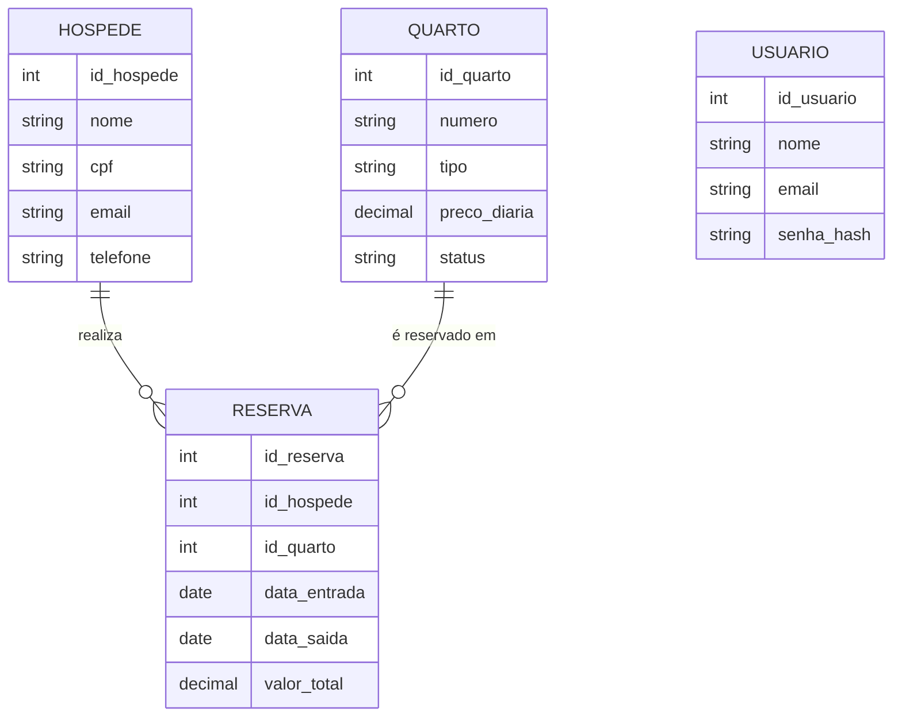

# Projeto Hotel Twister - ADS 2026/1

Sistema Web Fullstack para gerenciamento de hotelaria desenvolvido sob a arquitetura MVC com Node.js, Express, EJS e MySQL.

## 🛠️ Tecnologias e Dependências
- Backend: Node.js / Express
- Frontend: EJS / Bootstrap 5
- Banco de Dados: MySQL (Persistente)
- Segurança: Sessions (express-session) para controle de rotas e Bcrypt para hashing de senhas
- Driver de banco: mysql2 (queries nativas, sem ORM)

## 📁 Estrutura do Projeto

```
/Projeto Hotel Twister
  /Database
    schema.sql        -> criação das tabelas (usuario, hospede, quarto, reserva)
    seed.sql           -> massa de dados inicial (usuário admin, hóspedes e quartos de teste)
  /src
    /config            -> conexão com o banco (database.js)
    /controllers        -> regra de aplicação de cada entidade
    /middLewares        -> proteção de rotas autenticadas
    /models             -> acesso a dados (queries)
    /routes              -> definição das rotas Express
    /views               -> templates EJS organizados por entidade
  server.js             -> ponto de entrada da aplicação
  .env                   -> variáveis de ambiente (porta, credenciais do banco)
```

## 🗂️ Modelo de Dados (DER)



Cada reserva está vinculada a exatamente um hóspede e a um quarto. Ao criar ou excluir uma reserva, o status do quarto envolvido é atualizado automaticamente entre `Disponível` e `Ocupado`.

## 🚀 Como Executar o Projeto Localmente

1. Certifique-se de ter o MySQL ativo (XAMPP/WampServer/MySQL Workbench).
2. Importe os arquivos da pasta `/Database` (`schema.sql` e depois `seed.sql`) no seu banco, na ordem indicada.
3. Confira o arquivo `.env` na raiz do projeto e ajuste as credenciais do seu MySQL local se necessário:
   ```
   PORT=3000
   DB_HOST=localhost
   DB_USER=root
   DB_PASS=
   DB_NAME=hotel_twister
   SESSION_SECRET=segredotwister2026
   ```
4. No terminal do projeto, instale as dependências:
   ```bash
   npm install
   ```
5. Inicie o servidor:
   ```bash
   npm start
   ```
6. Acesse no navegador: `http://localhost:3000`

### 🔑 Credenciais de Acesso (usuário de teste)
- **E-mail:** admin@hotel.com
- **Senha:** admin123

> Se você já havia rodado o `seed.sql` antigo antes desta atualização, rode manualmente o comando abaixo no seu banco para corrigir o hash de senha do usuário admin (o `seed.sql` usa `ON DUPLICATE KEY UPDATE id_usuario=id_usuario`, que não sobrescreve uma linha já existente):
> ```sql
> UPDATE usuario SET senha_hash = '$2b$10$dAPKQXI/pqWDvnmRj5XuVu4d0ETkAz7CL/JiZTQp6TrpLT1qlvxZe' WHERE email = 'admin@hotel.com';
> ```

## 📮 Rotas da API (Postman)

O projeto expõe rotas REST com prefixo `/api` para testes via Postman. A collection `Hotel_Twister.postman_collection.json` já está incluída na raiz do projeto — basta importar no Postman.

**Autenticação:**
- `POST /api/login` — realiza login e inicia sessão
- `POST /api/logout` — encerra a sessão

**Hóspedes:**
- `GET /api/hospedes` — lista todos
- `GET /api/hospedes/:id` — busca por ID
- `POST /api/hospedes` — cadastra novo
- `PUT /api/hospedes/:id` — atualiza
- `DELETE /api/hospedes/:id` — exclui

**Quartos:**
- `GET /api/quartos` — lista todos
- `GET /api/quartos/:id` — busca por ID
- `POST /api/quartos` — cadastra novo
- `PUT /api/quartos/:id` — atualiza
- `DELETE /api/quartos/:id` — exclui

**Reservas:**
- `GET /api/reservas` — lista todas
- `GET /api/reservas/:id` — busca por ID
- `POST /api/reservas` — cadastra nova (atualiza status do quarto automaticamente)
- `PUT /api/reservas/:id` — atualiza (troca de quarto libera o antigo e ocupa o novo)
- `DELETE /api/reservas/:id` — exclui (quarto volta para Disponível automaticamente)

> **Atenção:** todas as rotas `/api` exceto `/api/login` exigem autenticação. Faça o login primeiro — o Postman guarda o cookie de sessão automaticamente.

## ✅ Funcionalidades Implementadas

- Login, logout e proteção de rotas por middleware de sessão (`authMiddLeware.js`).
- CRUD completo de **Hóspedes** (cadastro, listagem, edição, exclusão).
- CRUD completo de **Quartos** (cadastro, listagem, edição, exclusão, com badges de status).
- CRUD completo de **Reservas** (cadastro, listagem, edição e exclusão), com atualização automática do status do quarto vinculado.
- Validação de campos obrigatórios nos formulários e tratamento de erros de exclusão quando há vínculo entre entidades (ex.: não é possível excluir um quarto com reserva ativa).

## 👥 Integrantes e Responsabilidades

| Integrante | Responsabilidade / CRUD | Apoio de IA recebido |
|---|---|---|
| Higor Domingos | Hóspedes (model, controller, rotas, views) | Revisão de código e explicação de erros |
| João Pedro Alves Moreira | Quartos (model, controller, rotas, views) | Geração de massa de dados e revisão de queries |
| Lorminus | Reservas e Autenticação (model, controller, rotas, views, login/sessão) | Correção de bugs de case-sensitivity e segurança no login |

## 📋 Gestão Ágil

Quadro Kanban da equipe com as colunas A Fazer, Em Desenvolvimento, Em Revisão e Concluído:

🔗 [https://github.com/users/hdomigos10/projects/1/views/1](https://github.com/users/hdomigos10/projects/1/views/1)

## 🤖 Uso de Inteligência Artificial

O uso de IA durante o desenvolvimento está documentado de forma crítica e detalhada no arquivo [`USO_IA.md`](./USO_IA.md), incluindo ferramentas utilizadas, prompts, o que foi aceito/adaptado/recusado e os cuidados tomados para evitar cópia sem compreensão técnica.
